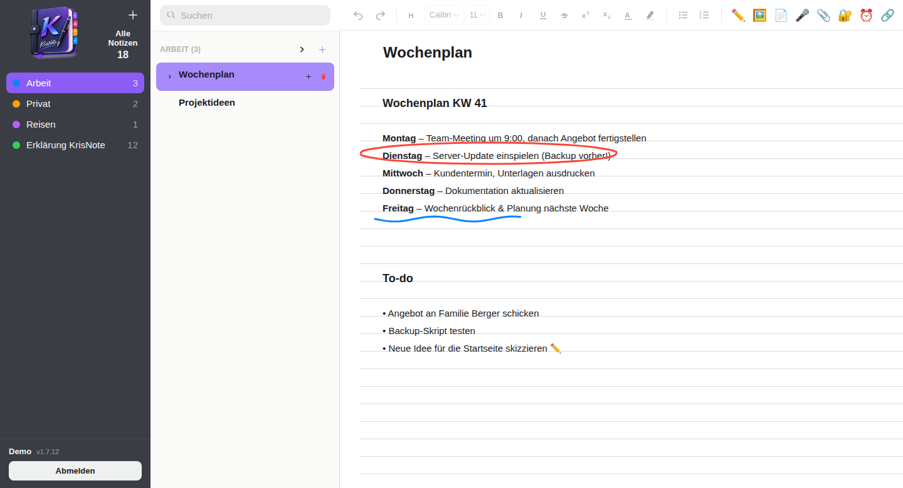
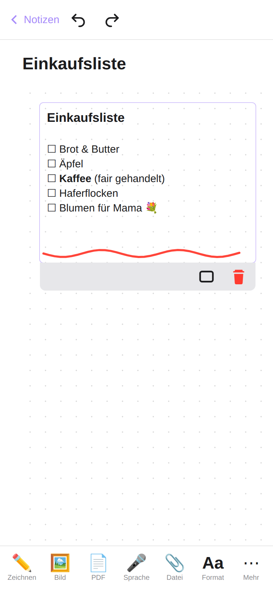
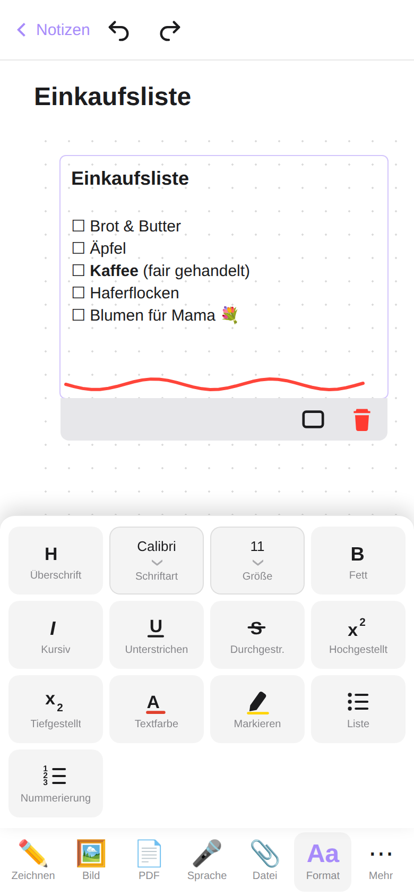
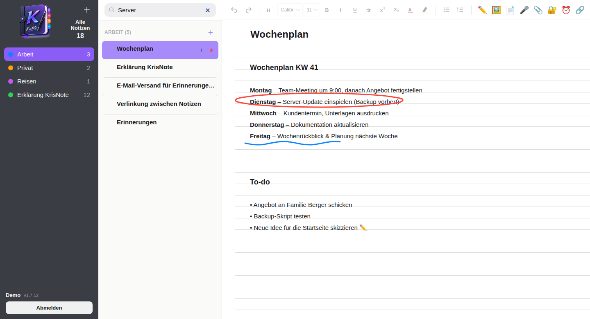

<p align="center">
  
</p>

<h1 align="center">KrisNote</h1>

<p align="center">
  <b>Deine Notizen. Dein Server. Deine Daten.</b><br>
  Eine kostenlose, selbst gehostete Notizen-App im Stil von OneNote - für PC, Tablet und Handy.
</p>

<p align="center">
  <b>Deutsch</b> · <a href="README.en.md">English</a>
</p>

<p align="center">
  <a href="https://github.com/KrisamAnton/KrisNote/releases">Version 1.7.12</a> ·
  <a href="LICENSE">MIT-Lizenz</a> ·
  <a href="CHANGELOG.md">Änderungsverlauf</a> ·
  <a href="https://www.paypal.me/KrisamKreativStudio">Projekt unterstützen</a>
</p>

<p align="center">
  
</p>

## Was ist KrisNote

KrisNote ist eine Notizen-App, die du **auf deinem eigenen Server** betreibst
(Raspberry Pi, Mini-PC, Proxmox-Container, NAS, VPS - alles mit Linux und
Node.js). Du bedienst sie ganz normal im Browser oder als installierte App
auf Handy, Tablet und PC. Es gibt **keine Cloud eines fremden Anbieters**, kein
Konto bei einer Firma und keine Werbung.

- Ordner, Notizen und **beliebig tief verschachtelte Unterseiten**
- Text, Bilder, PDFs, Dateianhänge und **Handschrift/Zeichnungen** frei auf einer Fläche
- Formatierung wie in Word: Überschriften, Fett/Kursiv, Listen, Farben, Markierungen
- **Sprachnotizen** aufnehmen - optional automatisch in Text umwandeln (Transkription)
- **Erinnerungen per E-Mail**, Verlinkung von Notizen untereinander, Suche über alle Notizen
- Bereich für **Zugangsdaten** (Benutzername/Passwort übersichtlich ablegen)
- Mehrere Benutzer, jeder mit seinen eigenen, getrennten Notizen
- Eigene **Bedienung für das Handy** (große Knöpfe, Werkzeugleiste unten)

## Warum nicht einfach OneNote?

OneNote ist ein gutes Programm - aber es gehört einem Konzern. KrisNote ist für
alle, die ihre Notizen lieber selbst in der Hand haben:

| | KrisNote | typische Cloud-Notizen-App |
|---|---|---|
| **Wo liegen deine Daten?** | Auf deinem eigenen Server | Bei einem fremden Anbieter |
| **Konto/Anmeldung bei einer Firma** | nicht nötig | meist Pflicht |
| **Kosten** | kostenlos, MIT-Lizenz | oft Abo für alle Funktionen |
| **Daten verlassen deinen Server?** | Nein - nichts wird irgendwohin gesendet | Ja |
| **Backup & Export** | Ein Ordner (`data/`) - einfach kopieren | Über den Anbieter |
| **Quellcode einsehbar** | Ja, komplett | Nein |
| **Unterseiten** | beliebig tief | meist begrenzt |

**Datenschutz in einem Satz:** KrisNote hat keine Telemetrie, kein Tracking und
keine Verbindung zu irgendwelchen Diensten des Entwicklers - alles, was du
schreibst, zeichnest oder hochlädst, bleibt in einem Ordner auf *deinem* Server.
(Zwei Dinge, die du selbst einschaltest, sind die Ausnahme: die optionale
Erinnerungs-E-Mail, die über den Mail-Server verschickt wird, den du selbst
einträgst - und die optionale Sprach-Transkription, die beim ersten Mal das
Spracherkennungs-Modell herunterlädt. Deine Aufnahmen selbst werden dabei
nie versendet, die Umwandlung läuft auf deinem Server.)

<p align="center">
  
  &nbsp;&nbsp;
  
</p>

<p align="center">
  
</p>

## Ehrlich gesagt: Was KrisNote (noch) nicht ist

Damit du nicht überrascht wirst:

- **Du brauchst einen eigenen Server** (oder einen kleinen Rechner, der dauerhaft läuft) und musst ihn selbst aktuell halten und sichern. Die [Installation](#installation) ist dafür mit einer Zeile erledigt, ein Backup musst du aber selbst einrichten.
- **Kein Offline-Betrieb:** Die App braucht die Verbindung zu deinem Server, um Notizen zu laden und zu speichern.
- **Kein gemeinsames Bearbeiten in Echtzeit** - jeder Benutzer hat seine eigenen Notizen.
- **Kein Import aus OneNote** und keine native App aus dem App Store - KrisNote ist eine Web-App (PWA), die du auf dem Handy zum Startbildschirm hinzufügen kannst.
- Ein **Ein-Personen-Projekt**: Fehler sind möglich. Mach regelmäßig ein Backup (siehe [Backup](#backup)) und melde Probleme gern als [Issue](https://github.com/KrisamAnton/KrisNote/issues).

## Wie ist KrisNote entstanden?

KrisNote wurde von **Krisam gemeinsam mit einer KI** (Claude von Anthropic)
entwickelt: Die Ideen, Wünsche, das Testen am echten Gerät und alle
Entscheidungen kommen vom Menschen, den Großteil des Codes hat die KI
geschrieben. Wir sagen das offen, weil du wissen sollst, was du dir auf den
Server holst - der gesamte Quellcode liegt hier offen zum Nachlesen. Er wurde
mehrfach von Hand getestet; trotzdem gilt wie bei jeder Software: Sichere deine
Daten.

## Voraussetzungen

- Ein Linux-Server, eine VM oder ein LXC-Container, der dauerhaft läuft
  (z. B. Debian oder Ubuntu). Proxmox ist ein mögliches Beispiel für die
  Virtualisierung, aber keine Voraussetzung - jeder Linux-Rechner mit
  Node.js funktioniert.
- **Node.js Version 20 oder neuer.** (Diese Anforderung kommt von einer der
  verwendeten Bibliotheken, `nodemailer`, die Node.js 20+ voraussetzt.)
- **Für die Sprachnotiz-Transkription (optional, nur falls gewünscht):**
  zusätzlich Python 3 mit den Paketen aus `server/requirements.txt`
  (`faster-whisper`, `pyannote.audio`) sowie `torch`. Ohne diese
  Installation funktioniert KrisNote ganz normal - nur der Knopf "In Text
  umwandeln" bei Sprachaufnahmen bleibt dann ohne Wirkung.

## Installation

**Am einfachsten: Installations-Skript** (Debian/Ubuntu, als root). Installiert
Node.js falls nötig, klont das Repository nach `/opt/krisnote`, führt
`npm install` aus und richtet KrisNote gleich als systemd-Dienst ein (läuft
danach dauerhaft, auch nach einem Server-Neustart):

```bash
apt-get update && apt-get install -y curl && curl -fsSL https://raw.githubusercontent.com/KrisamAnton/KrisNote/main/install.sh | bash
```

(Der erste Teil installiert `curl`, falls es noch fehlt - auf frischen
Debian-Containern ist das oft der Fall. Ist `curl` schon da, schadet er nicht.)

Am Ende zeigt das Skript die Adresse an. Den Einrichtungscode für den ersten
Start findest du mit `journalctl -u krisnote -n 20`.

Falls der Einzeiler bei dir nicht durchläuft, geht es auch in zwei Schritten
(erst die Datei holen, dann ausführen):

```bash
curl -fsSL -o install.sh https://raw.githubusercontent.com/KrisamAnton/KrisNote/main/install.sh
bash install.sh
```

Zielordner und Dienst-Benutzer lassen sich davor per Umgebungsvariable
anpassen, z. B. `INSTALL_DIR=/srv/krisnote bash install.sh`.

**Von Hand** (falls man mehr Kontrolle möchte, oder das Skript nicht passt):

```bash
git clone https://github.com/KrisamAnton/KrisNote.git KrisNote
cd KrisNote/server
npm install
```

Dauerhaft als Dienst starten (systemd): Im Ordner `deploy/` liegt eine
Vorlage-Datei (`krisnote.service`). Sie kopieren, die Platzhalter (Pfad,
Benutzername) anpassen und einrichten:

```bash
sudo cp deploy/krisnote.service /etc/systemd/system/krisnote.service
sudo nano /etc/systemd/system/krisnote.service   # Platzhalter anpassen
sudo systemctl daemon-reload
sudo systemctl enable --now krisnote
```

Die Vorlage-Datei selbst enthält weitere Erklärungen als Kommentare.

**Nur zum kurzen Ausprobieren** (läuft, bis das Terminal-Fenster
geschlossen wird):

```bash
cd KrisNote/server
npm start
```

Der Server ist danach standardmäßig unter `http://<server-adresse>:3000`
erreichbar.

## Erster Start

Direkt nach der Installation (noch kein Benutzer vorhanden) ist die App im
Einrichtungsmodus:

1. Server starten (siehe oben).
2. Im Server-Log nach der Zeile `Einrichtungscode:` suchen:
   - Bei einem systemd-Dienst: `journalctl -u krisnote -n 50`
   - Sonst: direkt im Terminal-Fenster, in dem der Server gestartet wurde
3. Im Browser `http://<server-adresse>:3000/setup.html` öffnen
   (`/login.html` leitet automatisch dorthin um, solange noch kein
   Benutzer existiert).
4. Einrichtungscode, gewünschten Benutzernamen, optional einen
   Anzeigenamen und ein Passwort (mind. 8 Zeichen) eingeben. Man ist
   danach sofort angemeldet.
5. Sobald dieser erste Benutzer existiert, ist `/setup.html` dauerhaft
   gesperrt - ein erneuter Aufruf leitet nur noch zu `/login.html` um.

Nach 5 falschen Einrichtungscode-Eingaben ist die Einrichtung für 15
Minuten gesperrt (Schutz gegen Erraten des Codes durch Dritte im selben
Netzwerk).

## Version sehen

Die installierte Version steht dezent in den Einstellungen der App (Klick
auf den eigenen Benutzernamen unten links) sowie unten auf der
Anmeldeseite, und lässt sich auch direkt abrufen:

```bash
curl http://<server-adresse>:3000/api/version
```

Neue Versionen werden in [CHANGELOG.md](CHANGELOG.md) mit ihren Änderungen
aufgelistet und als Git-Tag (z. B. `v1.7.12`) im Repository markiert.

## Einstellungen per Umgebungsvariable

Alle Variablen sind optional - ohne sie gelten die Standardwerte. Sie
lassen sich beim Start setzen (z. B. `PORT=3000 npm start`) oder als
`Environment=`-Zeile im systemd-Dienst (siehe `deploy/krisnote.service`).

| Variable | Standardwert | Erklärung |
|---|---|---|
| `PORT` | `3000` | Port, auf dem der Server erreichbar ist. |
| `DATA_DIR` | `<Installationsordner>/data` | Ordner für Benutzerkonten, Notizen und hochgeladene Dateien. |
| `ALLOW_REGISTRATION` | aus | Auf `true` setzen, damit sich beliebige Personen über die Anmeldeseite selbst einen Zugang anlegen können. Standardmäßig aus - weitere Benutzer legt man sonst per Kommandozeile an (siehe unten). |
| `SETUP_CODE` | zufällig erzeugt | Erlaubt, den Einrichtungscode für den allerersten Start fest vorzugeben, statt ihn zufällig erzeugen und im Log ausgeben zu lassen. |
| `TRUST_PROXY` | aus | Nur nötig, wenn KrisNote **hinter einem Reverse-Proxy** läuft (z. B. Cloudflare Tunnel, nginx, Caddy). Wert: Anzahl der vorgeschalteten Proxys (meist `1`) oder die Adresse des Proxys (z. B. `10.0.0.5` oder `loopback`). Siehe Abschnitt "Von unterwegs erreichen und HTTPS". |
| `PYTHON_BIN` | `python3` | Pfad zum Python-Interpreter für die Transkription (z. B. bei Verwendung eines eigenen venv). |
| `WHISPER_MODEL` | `medium` | Modellgröße für die Spracherkennung (`small` ist schneller, aber etwas ungenauer). |
| `TRANSCRIBE_LANGUAGE` | `de` | Sprache, die die Transkription erwartet. |
| `HF_TOKEN` | leer | Hugging-Face-Zugriffstoken für die Sprechererkennung bei Transkriptionen (optional). Ohne Token wird nur der reine Text erkannt (ein Sprecher). |

**Weitere Benutzer per Kommandozeile anlegen** (unabhängig von
`ALLOW_REGISTRATION` immer möglich):

```bash
node server/create-user.js <benutzername> <passwort> [Anzeigename]
```

## Update

**Am einfachsten:** Wenn du KrisNote mit dem Installations-Skript eingerichtet
hast, führst du als root einfach dieselbe Installationszeile noch einmal aus
(siehe "Installation"). Das Skript holt den neuesten Stand und startet den Dienst
neu. Deine Notizen und Einstellungen bleiben unverändert.

**Von Hand:**

1. **Vorher immer ein Backup von `data/` anlegen** (siehe Abschnitt
   "Backup" unten). Gilt auch vor dem Update per Skript.
2. Neuen Code holen und Abhängigkeiten aktualisieren (beim Installations-Skript heißt der Ordner `/opt/krisnote`):
   ```bash
   cd KrisNote
   git pull
   cd server
   npm install   # nur nötig, falls sich Abhängigkeiten geändert haben
   ```
3. Dienst neu starten:
   ```bash
   sudo systemctl restart krisnote
   ```

Der `data/`-Ordner ist nicht Teil des Repositorys (siehe `.gitignore`) und
wird von `git pull` nie angerührt oder überschrieben.

## Backup

Der komplette Datenbestand (Benutzerkonten, alle Notizen, hochgeladene
Bilder/PDFs/Aufnahmen, Erinnerungs-Mail-Einstellungen) liegt ausschließlich
im `data/`-Ordner (Pfad über `DATA_DIR` änderbar, siehe oben). Diesen Ordner
regelmäßig sichern, z. B.:

```bash
tar -czf krisnote-backup-$(date +%F).tar.gz -C KrisNote data
```

Für ein garantiert konsistentes Backup den Dienst währenddessen kurz
stoppen (`sudo systemctl stop krisnote`, nach dem Backup wieder
`sudo systemctl start krisnote`) - im laufenden Betrieb sichern funktioniert
in der Praxis aber ebenfalls, da Schreibvorgänge atomar sind.

## Von unterwegs erreichen und HTTPS (optional)

Direkt nach der Installation ist KrisNote nur in deinem Heimnetz unter
`http://<server-adresse>:3000` erreichbar. Das reicht für viele völlig aus.
Willst du auch von unterwegs zugreifen (und das Handy-App-Gefühl mit
"Zum Startbildschirm hinzufügen" nutzen - das funktioniert nur über **HTTPS**),
hast du diese Möglichkeiten:

| Möglichkeit | Aufwand | Besonderheit |
|---|---|---|
| **Nur im Heimnetz** | keiner | sicherste Variante |
| **VPN** (z. B. Tailscale oder WireGuard) | gering | kein Port am Router offen; Handy muss im VPN sein |
| **Cloudflare Tunnel** | mittel | eigene Domain nötig, HTTPS automatisch, kein Port am Router offen |
| **Reverse-Proxy** (Caddy, nginx) | mittel | HTTPS per Let's Encrypt, Port 443 muss freigegeben werden |

**Beispiel Cloudflare Tunnel:** In Cloudflare unter *Zero Trust → Networks →
Connectors* einen Tunnel anlegen, einen *Published application route* mit
deiner Domain hinzufügen und als Service-URL `http://<server-adresse>:3000`
eintragen (die URL muss mit `http://` beginnen).

**Wichtig, sobald KrisNote aus dem Internet erreichbar ist:**

1. `ALLOW_REGISTRATION` **ausgeschaltet lassen** (Standard) - sonst kann sich jeder einen Zugang anlegen.
2. **Nur über HTTPS** erreichbar machen, damit Passwörter nicht unverschlüsselt übertragen werden.
3. Ein **starkes Passwort** verwenden.
4. **`TRUST_PROXY=1` setzen**, wenn ein Proxy/Tunnel davor sitzt (siehe unten).

**Was ist `TRUST_PROXY`?** Läuft KrisNote hinter einem Proxy oder Tunnel,
sieht der Server bei jeder Anfrage nur die Adresse des Proxys. Ohne
`TRUST_PROXY=1` trifft die Sperre nach Fehlversuchen dann alle Besucher
gemeinsam (jemand von außen könnte dein Konto durch absichtliche Fehlversuche
kurz sperren), und die Anmelde-Cookies werden nicht als "Secure" markiert. Der
**Installer fragt danach** und trägt es automatisch ein. Von Hand geht es so:

```bash
sudo systemctl edit krisnote
# im geöffneten Editor eintragen:
#   [Service]
#   Environment=TRUST_PROXY=1
sudo systemctl restart krisnote
```

Läuft KrisNote **ohne** Proxy (direkter Zugriff), die Einstellung **nicht**
setzen - sonst ließe sich die Adresse durch einen mitgeschickten Header
fälschen.

Mehr zur Sicherheit: [SECURITY.md](SECURITY.md).

## Projekt unterstützen

KrisNote ist und bleibt kostenlos. Wenn es dir gefällt und du die Arbeit
dahinter honorieren möchtest, freue ich mich über eine freiwillige Spende:
[paypal.me/KrisamKreativStudio](https://www.paypal.me/KrisamKreativStudio).
Der Link steht auch in der App unter Einstellungen.

## Lizenz

KrisNote steht unter der **MIT-Lizenz** (siehe [LICENSE](LICENSE)): Du darfst es
kostenlos nutzen, verändern und weitergeben - auch geschäftlich. Der
Urheber-Hinweis und der Lizenztext müssen dabei erhalten bleiben. Das Programm
wird ohne jede Gewährleistung bereitgestellt.

Enthaltene Fremdsoftware: [pdf.js](https://mozilla.github.io/pdf.js/) (Apache-2.0,
Lizenztext in `js/vendor/LICENSE-pdf.js.txt`) sowie die über `npm` installierten
Pakete (alle unter freizügigen Lizenzen wie MIT, ISC oder BSD).
